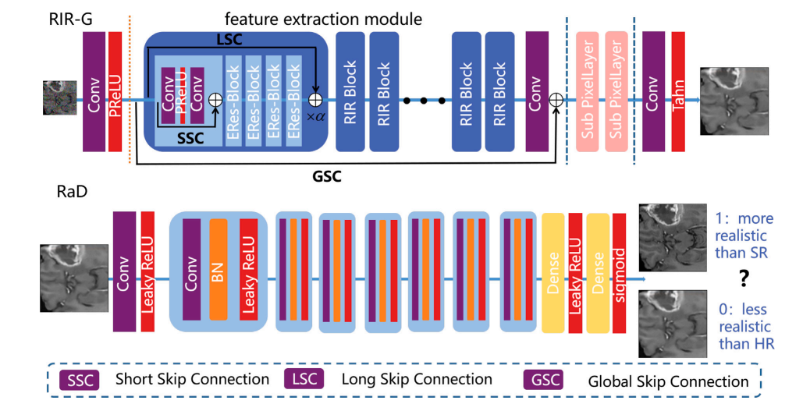
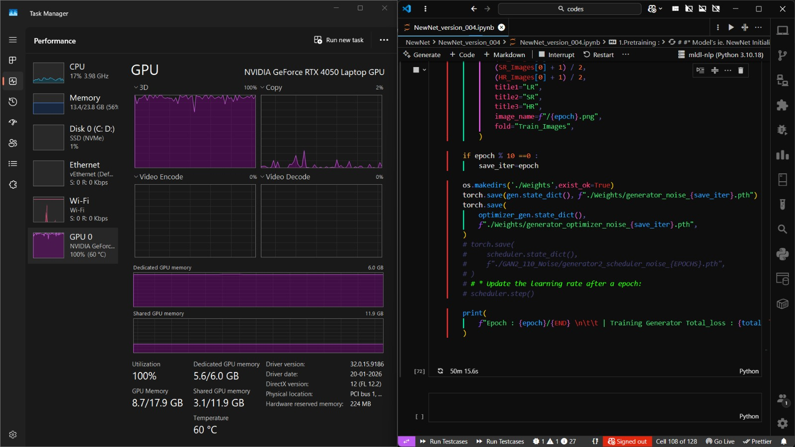
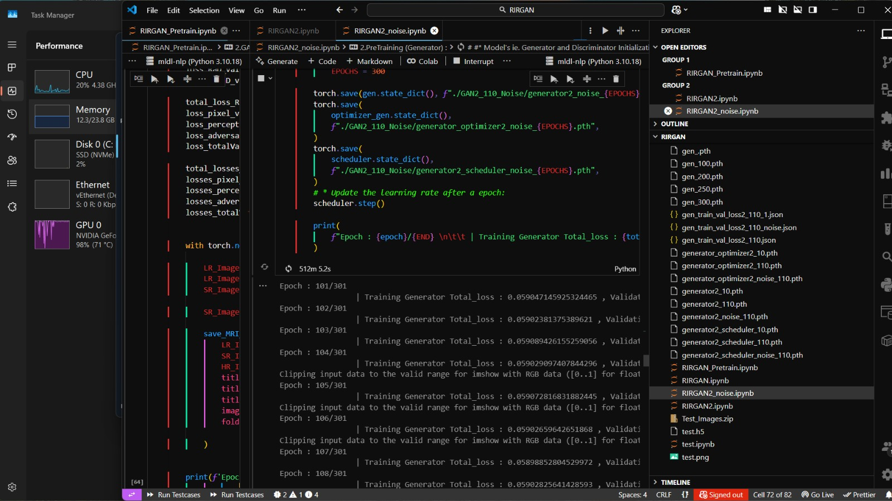
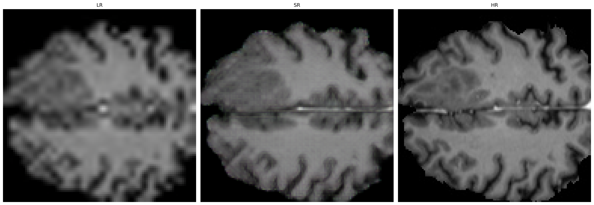
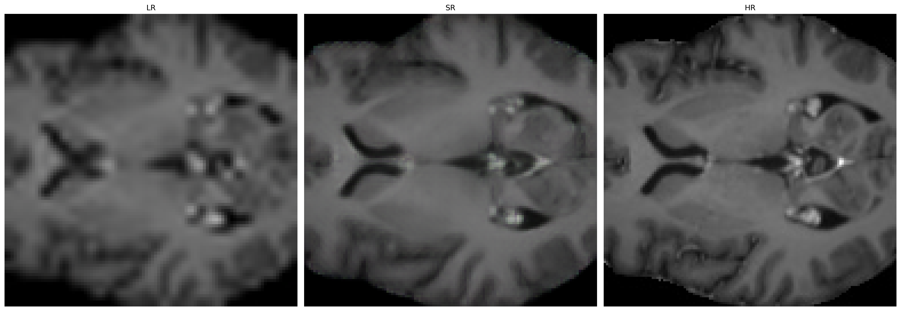

# RIRGAN: MRI Super-Resolution using a Residual-in-Residual GAN

A PyTorch reproduction of a **GAN-based single-image super-resolution model for brain
MRI scans**, built on the BraTS dataset. The model upscales low-resolution MRI slices
(32x32) 4x to high-resolution outputs (128x128), aiming to recover fine anatomical
detail that would otherwise require more expensive high-resolution scanning.

This repo reorganizes the original research notebooks into clean, modular,
importable Python code so the project structure and design decisions are easy to
review.

**Paper this work is based on:** [RIRGAN: An end-to-end lightweight multi-task
learning method for brain MRI super-resolution and denoising](https://www.sciencedirect.com/science/article/abs/pii/S0010482523010971)
(Computers in Biology and Medicine, Elsevier). This repo reproduces the
super-resolution part of the paper's RIR-G / RaD architecture.

## What this project does

- Implements a **Residual-in-Residual Generator (RIR-G)**: a deep CNN generator built
  from stacked residual blocks with local + global skip connections and sub-pixel
  (`PixelShuffle`) upsampling layers, inspired by SRGAN / ESRGAN-style architectures.
- Implements a **Relativistic average Discriminator (RaD)**: a convolutional
  discriminator trained with a relativistic adversarial loss (the discriminator
  estimates how much more realistic real data is than fake data, on average,
  rather than an absolute real/fake score).
- Trains in two stages, following the standard SRGAN-style recipe:
  1. **Generator pretraining** with pixel (L1) + VGG19 perceptual loss only, to give
     the generator a stable initialization.
  2. **Adversarial (GAN) fine-tuning**, where the pretrained generator and a fresh
     discriminator are trained jointly with a weighted combination of pixel,
     perceptual, adversarial, and total-variation losses.
- Evaluates results using **PSNR** and **SSIM**, implemented from scratch as
  vectorized batch metrics.

## Project structure

```
RIRGAN-MRI-Super-Resolution/
├── configs/
│   └── config.py           # All hyperparameters: generator, discriminator, data, training
├── data/
│   └── dataset.py           # RIRGAN_Dataset (BraTS .h5 loader, cropping, noise, LR/HR pairing)
├── models/
│   ├── generator.py         # RIR-G: EResidualBlock, RIRBlock, SubPixelLayer, RIRG
│   └── discriminator.py     # RaD: RadInputLayer, RadRepeatBlock, RadOutputLayer, Rad
├── losses/
│   └── losses.py             # Pixel, perceptual (VGG19), adversarial (relativistic), TV losses
├── metrics/
│   └── metrics.py            # PSNR, SSIM (vectorized, batch-wise)
├── utils/
│   └── visualization.py      # Plot/save MRI comparison images, grad-freeze helper
├── train_pretrain.py          # Stage 1: generator-only pretraining
├── train_gan.py                # Stage 2: adversarial fine-tuning
├── evaluate.py                  # Compute PSNR/SSIM on the test set
└── requirements.txt
```

## Architecture overview



**Generator (RIR-G):**

```
LR image -> Input Conv+PReLU
          -> 8x [RIR Block: 5x Enhanced Residual Blocks + scaled skip connection]
          -> Conv -> Global Skip Connection
          -> 2x Sub-Pixel (PixelShuffle) upsampling stages (4x total upscale)
          -> Output Conv + Tanh -> SR image
```

**Discriminator (RaD):**

```
Image -> Input Conv+LeakyReLU
       -> 7x [Conv -> BatchNorm -> LeakyReLU] (alternating stride 1/2, growing channels)
       -> Flatten -> Dense(1024) -> LeakyReLU -> Dense(1) -> relativistic score
```


## Trained from scratch, locally

Every result in this repo comes from an actual training run on a personal RTX 4050
laptop GPU — not just reproduced numbers from the paper. Screenshots below are from
the real training sessions: GPU pegged at 100% utilization while the generator
trains, and live epoch-by-epoch loss logs running across 300+ epochs.





## Results

Reproducing the paper's approach on the BraTS MRI dataset, the trained generator
achieves:

- **PSNR:** 27.43 dB
- **SSIM:** 0.80476

(measured on held-out MRI test slices, comparing 4x super-resolved output against
the original high-resolution ground truth)


## Sample results

Each triplet below shows the bicubic-upscaled low-resolution input (**LR**), the
model's 4x super-resolved output (**SR**), and the original high-resolution ground
truth (**HR**) for a held-out MRI slice:





The SR output recovers sharp cortical folds and ventricle boundaries that are
completely lost in the blurry LR input, closely matching the ground-truth HR scan.

## Training pipeline

1. **Data preparation:** BraTS MRI volumes are stored as per-slice `.h5` files. Each
   slice's Enhanced Tumor channel is cropped to a fixed HR patch, Gaussian noise is
   added to emulate scanner noise, and a bicubic downsample by 4x produces the
   paired LR input.
2. **Stage 1 - Pretraining** (`train_pretrain.py`): trains RIR-G alone against
   `pixel_loss + 0.01 * perceptual_loss`, with an Adam optimizer and step-decay
   learning rate schedule.
3. **Stage 2 - GAN fine-tuning** (`train_gan.py`): loads the pretrained generator,
   initializes a fresh RaD discriminator, and alternates discriminator/generator
   updates per epoch using:
   ```
   total_gen_loss = LAMBDA * pixel_loss
                  + GAMMA  * perceptual_loss
                  + ETA    * adversarial_loss
                  + BETA   * total_variation_loss
   ```
4. **Evaluation** (`evaluate.py`): runs the trained generator on the test set and
   reports PSNR/SSIM.

## Usage

```bash
pip install -r requirements.txt

# Stage 1: pretrain the generator
python train_pretrain.py

# Stage 2: adversarial fine-tuning, starting from a pretrained checkpoint
python train_gan.py --pretrained_gen checkpoints/gen_pretrain_200.pth

# Evaluate a trained generator on the test set
python evaluate.py --checkpoint checkpoints/gen_gan_200.pth
```

Expected dataset layout (paths configurable in `configs/config.py`):

```
data/
├── train/<volume_id>/<slice>.h5
├── val/<volume_id>/<slice>.h5
└── test/<volume_id>/<slice>.h5
```

Each `.h5` file contains an `image` dataset of shape `(H, W, 4)` (one channel per
MRI modality).

## Future work

Alongside this model, we are also developing a **second, independent deep learning
model** for the same MRI super-resolution task. It is currently reaching performance
close to (but not yet matching) the model in this repo. Work is ongoing to close
that gap and, ultimately, surpass the results reported above — the plan is to keep
iterating on the second model's architecture and training recipe until it
outperforms this implementation, then merge the learnings back into a unified,
improved pipeline.

## Notes

- This code is reorganized from research notebooks into a modular package for
  readability and reuse; the underlying model architecture, losses, and training
  procedure are unchanged from the original experiments.
- Dataset files (BraTS) are not included in this repo due to size/licensing;
  point `configs/config.py` at your own prepared `.h5` data directories.
